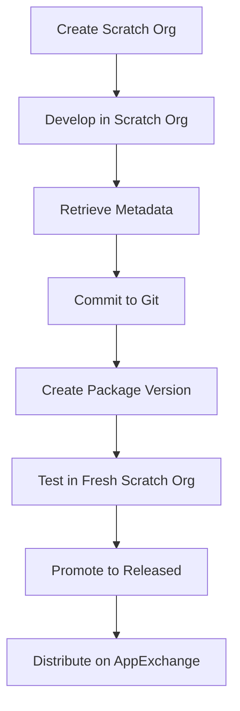

# Salesforce AppExchange Development - Cursor Rules


A comprehensive set of Cursor IDE rules for **Salesforce AppExchange development** following industry best practices. These rules enforce source-driven development, Second-Generation Managed Packaging (2GP), and modern Salesforce DX patterns.

## 📋 Table of Contents

- [Overview](#overview)
- [Quick Start](#quick-start)
- [Rule Categories](#rule-categories)
- [Installation](#installation)
- [Rule Details](#rule-details)
- [Contributing](#contributing)
- [Support](#support)
- [License](#license)

## 🔍 Overview

This repository contains **Cursor IDE rules** designed to ensure high-quality, AppExchange-ready Salesforce applications. The rules enforce:

- **Source-driven development** with Git as the single source of truth
- **Salesforce DX tooling** and CLI-first operations
- **Second-Generation Managed Packaging (2GP)** best practices
- **Modular architecture** patterns
- **Security and quality standards** for packaged applications

### 🎯 Target Audience

- **ISV developers** building applications for Salesforce AppExchange
- **Salesforce architects** designing enterprise solutions
- **Development teams** adopting modern Salesforce DX practices
- **Partner organizations** following Salesforce packaging standards

## 🚀 Quick Start

1. **Clone this repository**
   ```bash
   git clone https://github.com/your-org/cursor-salesforce-rules.git
   ```

2. **Copy rules to your Cursor workspace**
   ```bash
   cp .cursorrules your-salesforce-project/
   ```

3. **Start developing** with automatic rule enforcement in Cursor IDE

## 📚 Rule Categories

### 🤖 AgentExchange Development
Rules for building and packaging **AI Agents** for Agentforce and AgentExchange distribution.

**Key Focus Areas:**
- Agent Template generation and packaging
- Agentforce-enabled scratch org configuration
- Proper metadata handling for Bot and BotVersion components

### ⚡ Apex Best Practices
Guidelines for writing **high-quality, secure, and packageable** Apex code.

**Key Focus Areas:**
- Minimum 75% test coverage requirements
- Proper use of `@namespaceAccessible` annotations
- Intellectual property protection patterns
- Post-installation logic implementation

### 📦 Second-Generation Managed Packaging (2GP)
Comprehensive best practices for **modern Salesforce packaging**.

**Key Focus Areas:**
- CLI-first packaging operations
- Modular package architecture
- Namespace strategy and management
- Semantic versioning and upgrade paths

### 🔧 Scratch Org Configuration
Guidelines for creating **consistent development environments**.

**Key Focus Areas:**
- Feature and settings configuration
- Org shape capture and replication
- Environment-specific requirements (Agentforce, Experience Cloud, Data Cloud)

### ⚙️ Project Configuration
Best practices for **sfdx-project.json** configuration in modular applications.

**Key Focus Areas:**
- Package directory structure
- Dependency management
- API version pinning
- Post-install script configuration

## 📥 Installation

Download the `.cursorrules` file and place it in your Salesforce DX project root.


## 📖 Rule Details

### 🏗️ Development Principles

All rules enforce these core principles:

1. **Source-Driven Development**: Git is the single source of truth, not the org
2. **Salesforce DX Tooling**: All operations use Salesforce CLI
3. **Scratch Org Strategy**: Temporary, disposable development environments
4. **Dev Hub Management**: Centralized package and org management

### 🔒 Security & Quality Standards

- **Code Obfuscation**: Managed package IP protection
- **API Design**: Minimal global exposure, namespace-accessible patterns  
- **Test Coverage**: Comprehensive testing requirements
- **Dependency Management**: Declarative package dependencies

### 🚀 Packaging Strategy

- **Modular Architecture**: Small, focused, interdependent packages
- **Shared Namespace**: Efficient code sharing across packages
- **Semantic Versioning**: `major.minor.patch.build` format with `NEXT` keyword
- **Ancestor Tracking**: `HIGHEST` keyword for upgrade path management

## 🛠️ Development Workflow



## 🤝 Contributing

We welcome contributions! Please follow these guidelines:

1. **Fork** the repository
2. **Create** a feature branch (`git checkout -b feature/amazing-rule`)
3. **Test** your rules in a real Salesforce project
4. **Commit** with clear messages (`git commit -m 'Add: New packaging rule for XYZ'`)
5. **Push** to your branch (`git push origin feature/amazing-rule`)
6. **Open** a Pull Request

### 📝 Contribution Guidelines

- Rules must be based on **official Salesforce documentation**
- Include **citations** and references where applicable
- Test rules with **real-world scenarios**
- Follow **existing formatting patterns**
- Update documentation for **new rule categories**

## 📞 Support

- **Issues**: [GitHub Issues](https://github.com/your-org/cursor-salesforce-rules/issues)
- **Discussions**: [GitHub Discussions](https://github.com/your-org/cursor-salesforce-rules/discussions)
- **Salesforce Community**: [Trailblazer Community](https://trailhead.salesforce.com/trailblazer-community)

## 📄 License

This project is licensed under the **Apache License 2.0** - see the [LICENSE](LICENSE) file for details.

## 🙏 Acknowledgments

- **Salesforce Developer Relations** for comprehensive DX documentation
- **Salesforce Partner Community** for real-world packaging insights
- **Cursor IDE Team** for powerful rule-based development features

---

**Made with ❤️ by the Salesforce Developer Community**

*For the latest Salesforce development best practices, visit the [Salesforce Developer Documentation](https://developer.salesforce.com/)* 